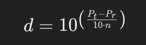
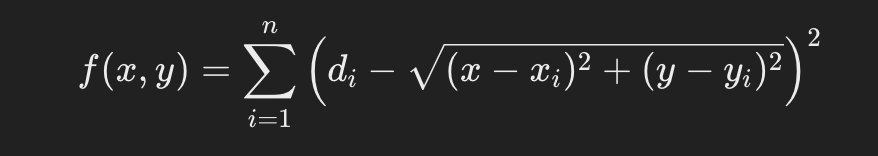

# Indoor localization using a modified trilateration algorithm
Indoor localization using a modified trilateration algorithm builds on the basic principles of trilateration but adapts it for more precise tracking in indoor environments, where factors like walls, interference, and non-ideal signal propagation must be considered. In an indoor setting, signals may not behave perfectly, so modifications or enhancements to the trilateration process are often necessary to improve accuracy.

## How to make it work:
```bash
  python3 -m venv venv
  source venv/bin/activate
  python 
```

## How Trilateration Works
### In trilateration:

Distance-based measurement: You determine the position of an object (Chip A) by measuring its distance from multiple reference points (machines).
Intersection of circles: Each reference point broadcasts a signal, and the distance to the object defines a circle. The intersection of these circles provides the object's location.
For indoor localization, challenges like signal reflections and interference (from walls, furniture, etc.) can distort the signal, making precise distance measurement harder. A modified trilateration algorithm aims to counteract these challenges and provide accurate localization.

## Key Modifications for Indoor Trilateration:
### Weighted Trilateration:

Due to environmental factors, not all signal strengths are equally reliable. Signals that are weaker or have more interference can be given less weight in the position calculation.
Instead of simply using the intersection of circles, you apply a weighting factor to each distance measurement based on the signal's quality, measured as signal-to-noise ratio (SNR) or other metrics.


​Where 𝑤𝑖 is the weight of each machine's signal based on its quality.

### Signal Smoothing and Filtering:

Since indoor signals can fluctuate due to reflections or obstacles, applying filters like a Kalman filter or particle filter can smooth out noisy measurements and estimate the position more accurately over time. This filtering can also account for movement and predict the object's next position.

### Kalman filter:
This recursive filter can provide an optimal estimation of the chip's position based on a series of measurements observed over time. It helps filter out noise and give a more accurate location.

### Multilateration with Time of Arrival (ToA) or Time Difference of Arrival (TDoA):

Rather than relying purely on signal strength, using Time of Arrival (ToA) or Time Difference of Arrival (TDoA) can be more precise for measuring the distance from machines to chip A. This is based on the travel time of the signal, assuming synchronized clocks between machines and chip A.
With TDoA, you measure the difference in signal arrival times from different machines, which is often more robust in environments where signal strength varies unpredictably.
Adaptive Path Loss Models:

In real-world environments, signal strength decays unpredictably due to walls and other obstructions. Using an adaptive path loss model that takes into account specific indoor features (like material properties of walls or furniture layout) can improve accuracy.
The path loss exponent in the signal attenuation formula can be dynamically adjusted based on environmental observations.



Where 𝑑 is the distance, 𝑃𝑡 is the transmitted power, 𝑃𝑟 is the received power, and 𝑛 is the path loss exponent, which can vary based on the environment.

### Non-Linear Least Squares (NLLS) Optimization:

Due to noise and interference, the intersection points of circles from trilateration are not always perfect. Non-linear least squares (NLLS) optimization can minimize the error in the calculated position by iteratively refining the position estimate. This approach minimizes the sum of squared differences between the estimated and measured distances.

In NLLS, you try to find a position (𝑥,𝑦) that minimizes the error function:



Where 𝑑𝑖 is the measured distance to machine 𝑖, and 
(𝑥𝑖,𝑦𝑖) is the position of machine 𝑖.

Algorithm Example
Here’s how a modified trilateration algorithm for indoor localization might/should? work:

### Step 1: Signal Collection:
Collect signal strength, Time of Arrival (ToA), or Time Difference of Arrival (TDoA) from multiple machines (at least 3 for 2D localization).

### Step 2: Distance Calculation:
Convert the collected data into estimated distances using a model (e.g., adaptive path loss model or ToA/TDoA-based distance estimates).

### Step 3: Weighting:
Assign weights to each machine based on signal quality (e.g., signal-to-noise ratio, multipath interference).

### Step 4: Initial Trilateration:
Apply basic trilateration using the weighted distances to find the rough position of the chip.

### Step 5: Optimization:
Use Non-Linear Least Squares (NLLS) to minimize the error and refine the chip’s position.

### Step 6: Signal Smoothing:
Apply a Kalman filter or similar smoothing algorithm to further improve accuracy over time.

## Advantages of a Modified Trilateration Algorithm:

### Improved Accuracy: 
By accounting for signal quality and environmental factors, the modified algorithm provides more accurate position estimates.

### Noise Resistance:
Filters like Kalman or particle filters help smooth out signal noise and prevent erratic position estimates.

### Flexibility:
Using ToA or TDoA can be more effective than relying on just signal strength, especially in complex indoor environments.

### Adaptation to Indoor Spaces:
Path loss models can be adapted to specific rooms, taking into account walls, obstacles, and materials, which can greatly affect signal behavior indoors.

### Example Scenario
Let’s assume you have a room where three machines (A, B, C) are placed. Chip A provides signal strength readings from these machines, and based on the distance, the trilateration algorithm starts by calculating rough distances from each machine. Using these distances, the algorithm calculates intersections of the broadcast circles and finds two potential points for Chip A.

Next, by applying the modified trilateration algorithm:

Weights are assigned to signals from each machine based on interference and signal quality.
Optimization is performed using NLLS to narrow down the position.
The algorithm applies signal smoothing to refine the position of Chip A over time.
In the end, Chip A's position is pinpointed more accurately than with a basic trilateration approach.

Conclusion
A modified trilateration algorithm for indoor localization combines classical trilateration principles with adaptations to handle the challenges of indoor environments, such as signal interference, multipath propagation, and walls. By incorporating weights, adaptive path loss models, and optimization techniques, it can deliver more precise localization results for tracking objects like Chip A within a confined space.
